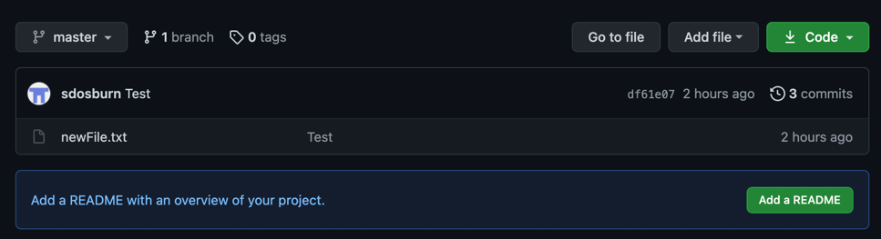
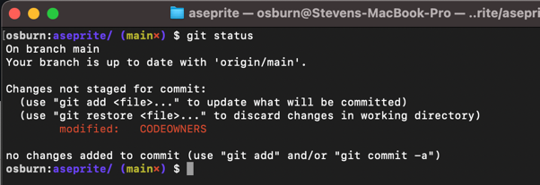
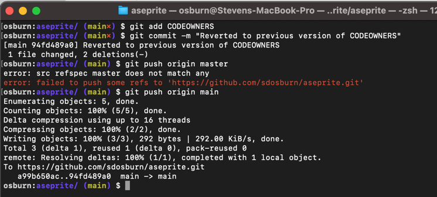
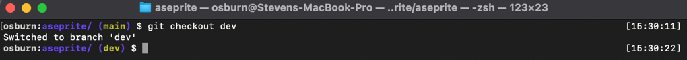

# Installing Git

?> The following steps are adapted from [git-scm.com](https://git-scm.com/book/en/v2/Getting-Started-Installing-Git).

## Windows

1. Download the latest pre-built package from https://git-scm.com/download/win.

## macOS

The simplest way to install git on macOS is to attempt to execute git from the terminal.

1. Open `Terminal` (Application > Utilities > Terminal)
2. Enter command `git --version`
    - If git is not currently installed, you will receive a pop-up that looks like:
    
    - Click `Continue` and select all default options.

## Linux

1. Identify the type of Linux distribution you are using.
    - Fedora, RHEL, and CentOS are **RPM-based**.
    - Ubuntu, and similar, are **Debian-based**.
2. From the builtin terminal on your system, execute the following installation command.
    - For **RPM-based** distributions: `sudo dnf install git-all`
    - For **Debian-based** distributions: `sudo apt install git-all`


---


# Configure your bash shell

## Windows

1. Launch `Git Bash Shell`

    

2. Download [these files](#) to your computer.
    - Copy the downloaded files to your user profile. *(eg: C:\Users\cjsturgess)*
3. From the bash terminal, execute the following commands to rename the downloaded files:
    - `mv terminal-config .terminal-config`
    - `mv bash_profile .bash_profile`
4. Close and re-open the bash shell.
5. In the top left corner of the bash shell window, click the icon, revealing a pop-up.

    

6. Click on `Options...`
    - Set `Background` to `White`
    - Set `Foreground` to `Blue`
    - Set `Transparency` to `Low`

## macOS

1. Open `Terminal` and verify git is installed.
    - Execute command `git --version` and verify your output is similar to this image:

    

?> We strongly recommend installing zsh on macOS. You can get it here: https://github.com/ohmyzsh/ohmyzsh

## Linux & Older macOS

1. Download [these files](#) to your computer.
2. Open the `bash_profile` file you just downloaded and copy all text.
3. From your terminal, execute command `cd ~`
    - *This will change your current directory to your home folder.*
4. Execute command `nano .bash_profile`
    - *This will open a command-line text editor.*
5. Paste in the contents of bash_profile you copied earlier.
6. Press `Control+X`, then `Shift+Y` to save and exit the editor.
7. Execute command `open .` to open your home directory in a file explorer window.
8. Copy the `terminal_config` file you downloaded earlier into this folder.
9. From the terminal, execute command `mv terminal_config .terminal_config` to rename the file.

---

# Configure git

> Our goal here is to set the default global username and email address for your git installation.

1. From `Terminal` (on macOS or Linux) or `Git Bash Shell` (on windows):
    - Execute command `git config --global user.name "Your Name"`
    - Execute command `git config --global user.email "Your Email"`
    - Execute command `git config --list` and verify your name and email are shown in the output.
2. *Optional:* Associtate your default text editor.
    - https://docs.github.com/en/get-started/getting-started-with-git/associating-text-editors-with-git


---


# Using git

## Creating your first commit

1. Open `Terminal` (on macOS or Linux) or `Git Bash Shell` (on windows)
2. Navigate to your home directory: `cd ~`
3. Create a new folder: `mkdir firstCommit`
4. Navigate to the new folder: `cd firstCommit`

    

    - **Tips & Tricks:** `cd foldername` will navigate to *foldername*, `cd ~` will navigate to your home directory, and `cd ..` will navigate up one directory.
5. Create a new file: `touch newFile.txt`
6. Type `ls -a` to view all files in your current directory.

    

7. Initialize the repository:
    - Execute command `git init`

    

    - Execute command `git branch -M main`

    - Execute command `ls -a`

    

        - Note that you should now see a `.git` directory and your current directory has been labeled `main`.
        - Also note the red **x** or **\#**. This means there are files in the directory that have not been added to the git repository.
    - To add `newFile.txt` to the repository, execute command `git add newFile.txt`

    

    - Now, we have to commit the changes to the repository.
        - Execute command `git commit -m "my first commit!"`

        

        - Note that the red x/\# has been removed.

---

## Review

1. Project Directory
    - We created a directory to contain our project files, using command `git init`.
    - *This only happens once during the lifetime of a project.*
2. Staging Area
    - Next, we added files to the staging area for review, using command `git add filename`.
    - *This happens multiple times throughout the lifetime of a project.*
3. Committed Area
    - Finally, we committed our changes to the repository and included a message for this commit, using command `git commit -m "message"`.
    - *This happens multiple times throughout the lifetime of a project.*

---

## Updating files

1. Open `newFile.txt` with the text editor of your choice.
2. Add the following text to the file:

```text
In Congress, July 4, 1776

The unanimous Declaration of the thirteen united States of America, 
When in the Course of human events, 
it becomes necessary for one people to dissolve the political bands which have connected them with another, 
and to assume among the powers of the earth, 
the separate and equal station to which the Laws of Nature and of Nature's God entitle them, 
a decent respect to the opinions of mankind requires that they should declare the causes which impel them to the separation.
```

3. Make sure to save your changes to this file.
4. To view the difference between our committed file and this newly changed file, execute command `git diff newFile.txt`


5. To exit the diff view, press `q` on your keyboard.
    - *Version a/filename is the committed file and version b/filename is the local, uncommitted file.*
6. Now, we want to update the file in the repository.
    - Execute command `git add newFile.txt` to add the file to the staging area.
    - Then, execute command `git commit -m "updated newFile.txt"` to commit the change to the repository.

    

    - You can see that there was 1 file changed with multiple insertions.


---


# Using GitHub

## Create a GitHub account

1. Go to https://github.com/
2. Click `Sign Up` and continue to register for an account.
    - **We strongly recommend that you use your personal email address, to ensure you have access to your account after graduation.**
3. Once your account is set up, sign up for the education pack: https://education.github.com/pack
    - **It can take up to 2 weeks for your educational account to be approved, so don't delay this step.**

## Create a repository

1. Once signed into your account, on the left side of the page, click `New`.


2. For repository name, enter `online_firstCommit` then select `Private`.
    - **Make sure to set all course-related repositories to private!**
3. Check `Add a README file`
4. Click `Create repository`


5. To add people to your repository:
    - Click `Settings` then `Manage Access`

    

    - Click `Invite Collaborator` and enter the other user's GitHub account email.

## Pushing your local repo to GitHub

1. First, we need to establish a connection between your local repo and GitHub.
    - Click the green `Code` button and copy the URL in the popup.

    

    - From your terminal, within the project directory used in the previous steps, enter command: `git remote add origin \<server address\>`.
        - Replace \<server address\> with the url copied in the previous step.

    

2. Push the files from your local repository to the remote repository.
    - Execute command `git pull origin main`

    

    - Execute command `git push -f origin main`

    

    - Your remote repository has now been updated. Refresh the GitHub repository page and you will see the files we added the commit history of our project.

    

    - Click `3 commits` and you can see the commit history and the user who made each commit.

    

---

## Editing files from GitHub

1. Click on the `Code` tab and then `newFile.txt`


2. To edit the file, click on the pencil icon on the right-hand side.


3. Add the following text to the file.

```text
We hold these truths to be self-evident, that all men are created equal, that they are endowed 
by their Creator with certain unalienable Rights, that among these are Life, Liberty and the 
pursuit of Happiness.--That to secure these rights, Governments are instituted among Men, deriving 
their just powers from the consent of the governed, --That whenever any Form of Government becomes 
destructive of these ends, it is the Right of the People to alter or to abolish it, and to institute 
new Government, laying its foundation on such principles and organizing its powers in such form, as 
to them shall seem most likely to effect their Safety and Happiness. Prudence, indeed, will dictate 
that Governments long established should not be changed for light and transient causes; and accordingly 
all experience hath shewn, that mankind are more disposed to suffer, while evils are sufferable, than 
to right themselves by abolishing the forms to which they are accustomed. But when a long train of 
abuses and usurpations, pursuing invariably the same Object evinces a design to reduce them under absolute 
Despotism, it is their right, it is their duty, to throw off such Government, and to provide new Guards 
for their future security.--Such has been the patient sufferance of these Colonies; and such is now the 
necessity which constrains them to alter their former Systems of Government. The history of the present 
King of Great Britain is a history of repeated injuries and usurpations, all having in direct object 
the establishment of an absolute Tyranny over these States. To prove this, let Facts be submitted to a candid world.
```


4. Add your comments and commit changes to the main branch.

5. Your local repository is now out of date. To update it:
    - Execute command `git pull origin main`

    

    - From the report we can see that there was 1 file modified with 1 insertion and 1 deletion. Feel free to open the file to validate the changes.
    - *Optional, but recommended:* Set up tracking – the local branch will track the remote branch.
        - Execute command `git branch --set-upstream-to=origin/main main`

        

        - Now, if there any changes to the main branch from GitHub, then there is no confusion when we do a pull. Let's try it! Update the file from GitHub, adding the following.

        ```text
            He has refused his Assent to Laws, the most wholesome and necessary for the public good.
            He has forbidden his Governors to pass Laws of immediate and pressing importance, unless suspended in their operation 
            till his Assent should be obtained; and when so suspended, he has utterly neglected to attend to them.

            He has refused to pass other Laws for the accommodation of large districts of people, unless those people would 
            relinquish the right of Representation in the Legislature, a right inestimable to them and formidable to tyrants only.

            He has called together legislative bodies at places unusual, uncomfortable, and distant from the depository of their 
            public Records, for the sole purpose of fatiguing them into compliance with his measures.

            He has dissolved Representative Houses repeatedly, for opposing with manly firmness his invasions on the rights 
            of the people.
        ```

        - Add your comments and commit changes.
        - Now, just execute `git pull`
            - Note that we didn't need to add origin and main.
        
        

---

## Useful Commands

?> These are great to know, but you don't need to execute them right now.

1. `git fetch` - Will download the files but it will not update the local repository
2. `git merge` - Merge the download with the local repository.
3. `git pull` - A combination of both fetch and merge.
4. `git status` - Gives an update on your local branch and let you know if your version is up to date.

---

## Forks & Clones

1. Forks
    - Allows you to download a repository to your system. It is copied to your account. When the fork is created all your updates and commits will only affect your branch. Also, when the original master is updated, your repository is not going to be updated.

    

    - If you find a repository you would like to fork, just click the fork button in the right hand corner.
        - Try it: Click on `Explore` at the top of the GitHub website.
        - Select `Pixel Art Tools`
        - Select `aseprite/aseprite`
        - Click `Fork`

        

        - Navigate back to your profile.
        - You have now created a fork of this project and are able to make changes and commits to the code. Notice in the left-hand side, your name/<repository project you forked>

        

        - If you were a collaborator on the project, you would be able to merge it back into the master. We will talk about that later.
2. Clones
    - Now that we have made a fork, we now want to download it on to our system so we can make changes. To do this we will need to clone the repository.
    - From the repository you want to clone, click `Code` and copy the HTTPS url.

    

    - Open your Terminal/Git Bash Shell
    - Create a new directory for this project
        - Execute command `mkdir repos`
        - Execute command `cd repos`

        

        - Execute command `mkdir aseprite`
        - Execute command `cd aseprite`

        

        - Execute command `git clone \<url\>`

        

        - To verify, execute command `ls`, then `cd aseprite`.

        

        - Notice we are now at master/main for the project. You can use any editor to edit the file. When you make changes and push them to the server, it will only update the fork that you created from the original repository. There is no need to set the remote because we cloned it from the remote repository.

---

## Repository Logs

1. From the cloned repository, execute command `git log`


2. Notice it has all the commits that were committed to the project. It will also give the full shaft. You only need the first 3-6 characters and not the whole thing.  Along with the commits it also gives you the name of the different contributors to the project.
    - To exit, press `q` on your keyboard.
3. We can use the first 8 characters of the commit ID to compare two different commits.


4. Now let's try something else:
    - Execute command `git show \<first 8 characters of commit ID\>`

    

    

    - We are now able to get more information than what we got from the log report. It also gives us the diff of what was changed. Basically, it's a merge of the log and diff commands.
    - We could look at other commits before the head. To do this we could do the following:
        - `git show HEAD~3`
            - This takes us back 3 commits.
        - `git diff HEAD~1 HEAD~3`
            - Shows the difference between the previous and 3rd from most recent commits.
        - `ls` then `git annotate \<filename\>`
            - Displays information about the file instead of the entire project.

            

            - We now are able to see who made changes and when to that line of code.
    - Let's make some modifications to the project.
        - Edit `CODEOWNERS.txt`
            - Add the line `* @\<your name\>`
            - Add the line `* @Open Source`
            - Save the file.
        - Execute `git status`
            - You should see that the file was modified.

            

        - We can do either of the following:
            - We can add the files, then commit.
                - Execute `git add CODEOWNERS.txt`
                - Execute `git commit -m "Add me to the list"`
                - Execute `git status`
                - Execute `git push origin main`
            - Or we can just commit the file.
                - Execute `git commit -a -m "Add me to the list"`
                - Execute `git status`
                - Execute `git push origin main`
        - Now, if we were contributors to this project, we could make a pull request to add ourselves to the code owners list.
            - From the repository page on GitHub, click `Pull Requests` and then `New Pull Request`

            

            - Then, click `Create Pull Request`

            

            - Review, then complete the pull request.
            
            ?> Please only make these test pull requests on your own repositories, we don't want to inconvenience maintainers of public repositories. :)

---

## Rolling back committs

What can we do if we have made a mistake on the local system? We would need to roll back to the previous commit.

- If we've made changes to local files, but didn’t commit to the changes, we could use the checkout command.
    - Execute `git status` and make sure no commits are needed.

    

    - Edit the CODEOWNERS.txt file and remove what we added and save.
    - Execute `git status` again, and note that there were changes.

    

    - Now, let's revert to the previous commit.
        - Execute `git checkout -- \<file name\>`

        

        - Review the file and you will notice the changes we made are gone. If we run the `git status` command, we can see that it is cleared.

        

- If we made changes and committed it, we can use the same command but instead of using the 2 –‘s, we would use hash.
    - Execute `git log`
    - Select one of the commits first 6 characters.
    - Execute `git checkout <6-characters> <name>`

    

    - Execute `git status`

    

    - Execute `git add CODEOWNERS`
    - Execute `git commit -m “Reverted to previous version of CODEOWNER”`
    - Execute `git push origin main`

    

---

## Adding multiple files

1. `git add .`
    - The `.` adds all files in the current directory which have been modified since the last commit.
2. To un-stage the files:
    - `git reset HEAD .`
3. We can also use `.` to check out files.
    - `git checkout -- .`

---

## Working with branches

Branches allow use to work on a set of code while keeping the original code in tact. You most commonly see this when you have updates or want to add features to the project. Once you have run all of the testing and verification you can then merge the branch into the master/main branch. In the real world you would see at minimum three branches.


In most cases the test branch, will be the main workforce and there will be very little commits to the master. The dev team will develop new features and the test team will create new branches to fix bugs in the project.


So where do these branches come from? The simple answer is they come from the master, and they are sub-branches of sub-branches. Each branch is a copy of the master/main branch it is pulled from. In the example of the test branch, you can see where the branch starts and where it is merged back into the master.


Let's try it!

1. Execute `git branch dev`
2. To see the branches type `git branch`


3. To access the branch type `git checkout dev`



4. You are now in the dev branch. Within this branch you can modify the code, make commits. Let’s create a feature branch.  We can do this with one command.
    - Execute `git checkout -b feature-1`

    

    - As you can see, if you close and reopen the terminal/Git Bash shell it keeps you in the last know checkout position.

    

    - To go back to master/main simply just type `git checkout main`

    

    - Let’s go back to feature-1.

    

    - Execute `open .` to view files in the finder/explorer. Let’s add a text file called `revisions.txt`

    

    - Execute `git status` then `git add .`

    

    - Execute `git commit -m “Added revisions.txt to project”`

    

    - We have made the changes and committed to the current branch. This commit has not modified any of the other branches. If you look in the dev branch, you will not see the file.

    

    - To sync the dev branch:
        - Execute `git push origin dev`

        

    - To sync the feature-1 branch:
        - Execute `git push origin feature-1`

        

    - Refresh GitHub and click on main and you will see the additional branches we created.

    

    - To merge the branches, and removed the unused one:
        - Make sure you are at the branch level that you are merging into.
        - Execute `git merge  <from location> <location>`

        

        - Delete the branch with command `git branch -d <name>`

        

        - Now, push dev to the remote with command `git push origin dev`

        

    - With all the different branches we might get confused on where the branch came from. We can use a git command to give us some insight on the relationship between them.
        - Execute `git log -graph`

        

---

## Excluding files from the project

1. Execute `ls -a`
    - By default there is a `.gitignore` file, if not then you will need to create one.
2. Execute `nano .gitignore`
3. Each line is a filename that git will ignore (not add to staging area or committed area).
    - Entire folders can be ignored, by appending a `/` to the end of the folder name.

---

## Fixing Merge Conflicts

When merges are done automatically, there usually aren't any issues, but when you have branches that are shared amongst a team, this is where the conflicts begin. As you can see from the first image, a branch was made from the dev, and was merged without any issues because there were no new commits the the dev branch. With the second image, you can see that on both branches there were commits to the some-feature branch and also the dev branch. If we tried to just merge the some-feature, we could receive errors.


The reason it could cause an error is if two branches are updating the same line of code in the same file, the merge would not know which one to use. So, it is our job to make that decision.

Types of Merges:
    - Fast forward merge - This is where the branch was created and no changes were made to the master/main. So, when the merge is executed, it’s able to update to the master without any issues.
    - Recursive merge - When you have two or more branches that are connected and there are at least two of the branches that have commits. These commits are not seen by the other branches, they are only visible to the one branch that created the commit. To fix this we have to create a new commit that combines the updates from the two branches.

Creating a merge conflict:
1. Let’s create a few new branches.
    - Execute `git checkout -b newUpdate1`
    - Execute `nano revisions.txt`
    - Add your name to the file then save it (CTRL+X, then SHIFT+Y).
    - Now, checkout the dev branch.
    - Add the file and commit.
    - Let’s now checkout the dev branch.
    - Let’s now create a new branch and call it newUpdate2
    - Let’s edit the revisions.txt file and add your pet’s name
    - Save and exit.
    - Add and commit the file.
    - Let’s checkout the dev branch and merge newUpdate2
    - Now, let’s try to merge the newUpdate1, notice we now have an error. The reason for the error is because we modified the reversions.txt in the two different branches.
    - If we need to abort the merge: `git merge --abort`
    - Resolve the conflict:
        - TODO